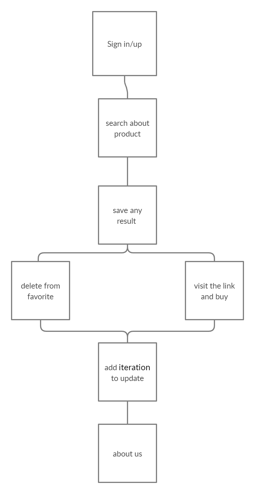

# Price-Comparison-Extension

Because of increasing demand for online shopping and how it makes shopping process much easier,so there is increasing of the number of the online shopping  websites and the strong competition between them , so the idea for our project came from this point .We decided to make a tool which will help the user to search for anything from the most famous online shopping websites then it will tell the user where to find the required thing at the lowest possible price , so this idea will reduce the time and the effort for searching process .

**Project Overview**

* GUI.
* Face recognition.
* Search.
* You can visit original link for any product.
* Add to favorite.
* And delete from favorite.
* You can also use automation system to re-check the prices every specific time.

**Tests!**

1 - tests to  check the price  for each website .

2- tests to check the lowest price in the data sit .

3- tests to  check the saved item and the price .

4- tests to check the items for specific person 

5-tests to the deleted item from the favourite 

**The Technology**

We achieved this project using python and we use these libraries :

* Numpy
* Opencv-python
* BeautifulSoup
* Face_recognition
* Tkinter
* Datetime

**Challenges**

We faced some challenges during working on our project such as :

When we did web scraping to get the data from famous online shopping websites ,we faced some problems to get the data because some websites deny the access to their data
When we used gui ,we had to learn about it first ,then we searched for best library to use ,also gui did not work in VScode so we used PyCharm to work on gui 
When we worked on face recognition part , the libraries we used for that worked well using linux but on windows devices they didn't work , so we forced to work on our teammate device who use linux
Sometimes we had some issues during connecting to each other because of bad internet connection sometimes 

**future plans**

1- we will make it as extension on chrome  

2- to link it with database 

3- make it as mobile app and can buy from the app  

# the process diagram:

